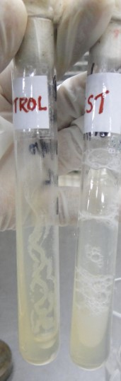

## Catalase Test

### Materials Required:

&nbsp;

#### Cultures:

• 24–48-hour tryptic soy broth cultures of bacteria

&nbsp;
 
#### Media: 
• Tryptic soy agar

&nbsp;
 
#### Reagent:
• 3% hydrogen peroxide

(Storage: -Upon receipt, store at 2-80C away from direct light. Reagents should not be used if there are signs of deterioration or if the expiration date has passed.)

&nbsp;
 
#### Equipments:
• Bunsen burner
• Inoculating loop
• Test tubes
• Test tube rack
• Microscopic slides

&nbsp;
 
### Procedure:
The test can be done by two methods.

a. Slant method

b. Slide method

&nbsp;
 
#### a. Slant Method:
 
1. Using a sterile technique, inoculate each experimental organism into its appropriately labeled tube by means of a streak inoculation.
2. Incubate all cultures for 24-48 hours at 370C
3. Allow three or four drops of the 3% hydrogen peroxide to flow over the entire surface of each slant culture.
4. Examine each culture for the presence or absence of bubbling or foaming.

&nbsp;

 
#### b. Slide Method:
1. Divide a clean glass slide into two sections with grease pencil. One should be labeled as “test” and the other as “control”.
2. Place a small drop of normal saline on each area.
3. With a sterilized and cooled inoculating loop, pick up a small amount of the culture from the nutrient agar slant or Petri plate.
4.	Emulsify one or two colonies on each drop to make a smooth suspension. The smear should be about the size of a pea.
5.	With a Pasteur pipette, place one drop of hydrogen peroxide over the test smear. Be careful not to run the drops together.
6.	Do not put anything in the other drop that serves as control.
7.	Observe the fluid over the smears for the appearance of gas bubbles.
8.	Discard the slide in a jar of disinfectant.

&nbsp;

#### Limitations:
 
1.	Hydrogen peroxide is unstable and should undergo a control check daily prior to use.
2.	Growth for catalase testing must be taken from an 18-24 hour culture. Organisms lose their catalase activity with age, resulting in a false-negative reaction.
3.	Catalase activity is a function of aerobic process. Organisms incubated anaerobically must be exposed to atmospheric oxygen for a minimum of 30 minutes before a catalase test is performed. Failure to complete this step may produce false-negative results.
4.	A positive catalase reaction with anaerobic organisms may be delayed for up to a minute after addition of the reagent.
5.	A weak catalase or pseudocatalase reaction may be produced by some strains of Aerococcus species and Enterococcus species.
 
#### Hints and Precautions:
 
1.	Dispose the hydrogen peroxide slides in the appropriate container filled with disinfectant. 
2.	Nichrome wire should be used when testing the organism. Platinum wires may cause a false-positive reaction.
3.	When using a slant for other purposes in the same laboratory period, it is possible to save material by adding H2O2 to the slant after finishing with it. 
4.	Extreme care must be taken if a colony is taken from a blood agar plate. Erythrocytes contain catalase, and a transfer of only a few blood cells can give a false-positive reaction.
5.	Always use fresh hydrogen peroxide, since it is unstable.
6.	Do not add organism to reagent, particularly if iron-containing inoculating loops are used. Iron containing loops will cause false positive test results if exposed to hydrogen peroxide.

&nbsp;

## Coagulase Test

### Materials Required:

The enzyme coagulase is demonstrated invitro by two methods
1. The Slide coagulase test
2. The Tube coagulase test

&nbsp;

### The Slide coagulase test
 
#### Principle:
 
This method measures bound coagulase. The bound coagulase is also known as clumping factor. It cross-links the α and β chain of fibrinogen in plasma to form fibrin clot that deposits on the cell wall. As a result, individual coccus stick to each other and clumping is observed.
 
#### Procedure:
 
1.	Divide the slide into two sections with grease pencil. One should be labeled as “test” and the other as “control
2.	2Place a small drop of distilled water on each area
3.	Emulsify one or two colonies of Staphylococcus on blood agar plate on each drop to make a smooth suspension
4.	The test suspension is treated with a drop of citrated plasma and mixed well with a needle
5.	Do not put anything in the other drop that serves as control. The control suspension serves to rule out false positivity due to auto agglutination
6.	Clumping of cocci within 5-10 seconds is taken as positive. 
7.	Some strains of S.aureus may not produce bound coagulase, and such strains must be identified by tube coagulase test

&nbsp;

### The Tube Coagulase Test
 
#### Principle:
 
This method helps to measure free coagulase. The free coagulase secreted by S.aureus reacts with coagulase reacting factor (CRF) in plasma to form a complex, which is thrombin. This converts fibrinogen to fibrin resulting in clotting of plasma.
 
#### Procedure:
 
1.	Three test tubes are taken and labeled “test”, “negative control” and “positive control”.
2.	Each tube is filled with 1 ml of 1 in 10 diluted rabbit plasma.
3.	To the tube labeled test, 0.2 ml of overnight broth culture of test
4.	bacteria is added.
5.	To the tube labeled positive control, 0.2 ml of overnight broth culture of known S.aureus is added
6.	To the tube labeled negative control, 0.2ml of sterile broth is added.
7.	All the tubes are incubated at 37oC and observe the suspensions at half hourly intervals for a period of four hours.
8.	Positive result is indicated by gelling of the plasma, which remains in place even after inverting the tube.
9.	If the test remains negative until four hours at 37oC, the tube is kept at room temperature for overnight incubation.

Coagulase positive test

&nbsp;

(+) ---    Delayed reaction

 d   ---    11- 89% of strains are positive
&nbsp;

### Applications:
 
1.	The coagulase test is used to distinguish between pathogenic and nonpathogenic members of the genus Staphylococcus. All pathogenic strains of S. aureus are coagulase positive whereas the nonpathogenic species(S. epidermidis) are coagulase negative.
2.	While slide coagulase test is useful in screening, tube coagulase test is useful in confirmation of coagulase test.
3.	Not all S.aureus strains produce coagulase; such rare strains are identified by thermonuclease test.

&nbsp;

### Limitations:
 
1.	The slide test should be read very quickly, as false positives can occur.
2.	Auto agglutination may occur.
3.	Use water instead of saline for mixing.
4.	The slide test should not be performed with organisms taken from high-salt media such as Mannitol Salt Agar, as the salt content can create false positives.
5.	Over mixing may cause the clot to break down.
6.	The tube test is more reliable than the slide test.
7.	We generally don’t use the coagulase test when identifying unknowns.
8.	Samples must be observed for clotting within 24 hours. This is because some strains that produce coagulase also produce an enzyme called fibrinolysin, which can dissolve the clot. Therefore, the absence of a clot after 24 hours is no guarantee that a clot never formed. The formation of a clot by 12 hours and the subsequent disappearance of the clot by 24 hours could produce a so-called false negative if the test were only observed at the 24-hour time.

